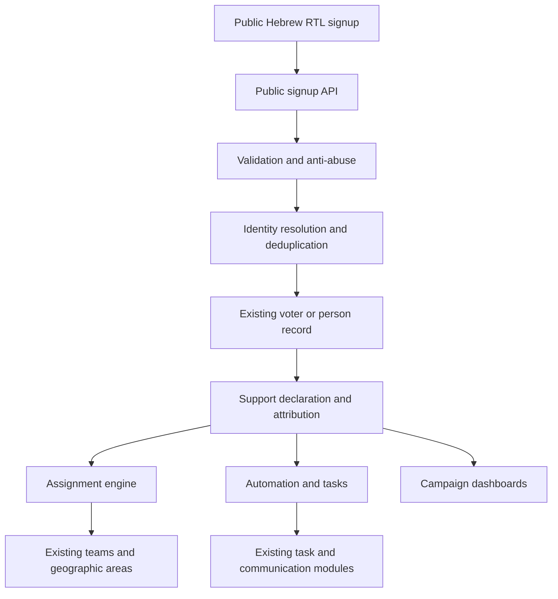

# Product Requirements Document

## Supporter Acquisition and Activation Module

**Product:** Hebrew RTL Election Campaign Platform  
**Document status:** Ready for planning and implementation  
**Target launch:** Within 2 months of election day  
**Primary language:** Hebrew  
**Layout direction:** RTL  
**Delivery model:** Public-facing module integrated directly with the existing election platform

---

## 1. Executive Summary

The Supporter Acquisition and Activation Module enables people to publicly declare support for a party or campaign through a fast mobile signup experience.

Every authorized campaign user can generate a personal link and QR code. When a supporter joins through that link, the platform records the recruiter, collects the minimum required information, detects duplicates, recommends a geographic assignment, and asks whether the supporter may also be interested in becoming an activist.

The module is not a separate voter-management system and must not maintain a second independent voter database. It is a public entry point connected to the existing election platform through its backend/API and existing voter records.

The primary product loop is:

> Declare support → classify automatically → invite to become active → create follow-up → encourage referrals

---

## 2. Problem Statement

Campaigns need to increase the number of known supporters during a short election period while avoiding three common problems:

1. Long registration forms cause abandonment.
2. Generic forms create large unsorted lists that require manual work.
3. Personal recruitment links can create ownership disputes when the recruited person belongs to another geographic area.

The campaign also needs reliable answers to:

- How many unique supporters do we have?
- How many supporters were added today or this week?
- Who recruited each supporter?
- Where are supporters geographically located?
- Which supporters may become activists?
- Who is responsible for following up?
- Which links, campaign users, events, and geographic areas perform best?

---

## 3. Product Goals

### 3.1 Primary goals

- Maximize completed supporter declarations.
- Minimize registration abandonment.
- Reduce manual sorting and assignment.
- Preserve recruiter attribution.
- Recommend geographic assignment automatically.
- Give campaign managers final control over ownership exceptions.
- Convert a percentage of supporters into activist candidates.
- Provide trustworthy supporter counts and acquisition analytics.
- Integrate directly with the current voters, users, teams, tasks, and geographic areas.

### 3.2 Secondary goals

- Allow event- and area-specific acquisition links.
- Generate follow-up tasks automatically.
- Enable supporters to invite additional supporters.
- Support communications through email, SMS, WhatsApp links, WhatsApp API, and phone calls.
- Provide exports for authorized campaign managers.

### 3.3 Non-goals for the pre-election release

- A separate supporter application.
- Supporter accounts, passwords, or dashboards.
- Complex supporter profiles during initial registration.
- Full volunteer scheduling during signup.
- Gamification, leaderboards visible to the public, or prizes.
- AI-based political profiling or automated persuasion.
- A second voter/contact database.
- Replacing the platform's existing team, task, voter, or geographic-area modules.

---

## 4. Confirmed Product Decisions

| Topic | Decision |
|---|---|
| Supporter definition | A person who explicitly selects **“I support”** |
| Required first-step information | Name, phone number, and city |
| Recruitment attribution | Personal link identifies the recruiting campaign user |
| Geographic handling | System recommends an area based on city/address data |
| Final ownership conflict | Campaign manager decides |
| Activist conversion | Every new supporter is invited to express activist interest |
| Public experience | Hebrew, RTL, mobile-first |
| Integration | Directly with the existing election platform |
| Data ownership | Existing voter/person record remains the master record |
| Supported communication channels | Email, SMS, WhatsApp links, WhatsApp API, and phone calls |

---

## 5. Users and Roles

### 5.1 Public visitor

- Opens a generic, personal, event, or area link.
- Explicitly declares support.
- Enters name, phone, and city.
- Optionally expresses interest in becoming an activist.
- Optionally shares a referral link.
- Does not create an account.

### 5.2 Campaign user / recruiter

- Generates or receives a personal recruitment link and QR code.
- Shares the link through supported channels.
- Sees permitted recruitment statistics.
- May see recruited supporter details only if allowed by role and assignment.
- Does not automatically own every person recruited through the link.

### 5.3 Geographic/team manager

- Sees supporters assigned to permitted areas or teams.
- Reviews follow-up tasks.
- Manages activist candidates according to existing permissions.
- May suggest assignments where permitted.

### 5.4 Campaign manager

- Sees campaign-wide supporter analytics.
- Configures landing-page branding and text.
- Configures assignment rules and communication templates.
- Reviews ambiguous or conflicting assignments.
- Assigns or reassigns operational ownership.
- Exports data where permitted.

### 5.5 System administrator

- Configures tenant/campaign settings.
- Manages roles, permissions, integrations, and technical settings.
- Reviews audit and delivery logs.
- Does not use public links to bypass normal campaign permissions.

---

## 6. Core Product Concept

The module has two surfaces:

1. **Public acquisition surface:** A fast public landing and signup flow.
2. **Internal management surface:** Links, assignments, automation, tasks, dashboards, and analytics inside the election platform.

The public surface may use a separate route or subdomain, but all writes must go through the existing platform backend.

Examples:

- `campaign.co.il/join`
- `join.campaign.co.il`
- `campaign.co.il/join/{shortCode}`
- `campaign.co.il/join/{shortCode}?source=event`

The short code must resolve server-side to a campaign, recruiter, source, event, or geographic area. Internal database identifiers must not be exposed in public URLs.

---

## 7. End-to-End Public User Flow

### 7.1 Entry

The visitor may arrive from:

- Generic campaign URL
- Campaign user's personal URL
- QR code
- Campaign event
- Geographic campaign stand
- SMS
- Email
- WhatsApp share
- Social advertisement or social post

The system records the source without requiring user action.

### 7.2 Landing screen

Required content:

- Campaign/party logo
- Campaign colors
- Candidate or campaign name
- Short value statement
- One primary CTA: **„אני תומך/ת”**
- Short privacy notice/link
- Accessible layout and controls

The support declaration must be explicit. It must not be preselected or inferred merely because the visitor opened the page.

### 7.3 Registration form

Displayed after the support CTA is selected.

Mandatory fields:

- Full name
- Mobile phone number
- City

Optional only when required by campaign policy:

- Consent to receive campaign updates

UX requirements:

- One screen
- Mobile numeric phone keyboard
- Searchable city selector from a controlled list
- Israeli phone formatting and normalization
- Inline errors without clearing entered information
- No password
- No email requirement
- No full address requirement
- No OTP before initial submission
- Submit button clearly confirms the action

Suggested Hebrew submit label:

> **מצטרפ/ת כתומכ/ת**

### 7.4 Successful declaration

Immediately after successful processing, show:

- Thank-you confirmation
- Optional phone verification action
- Activist-interest question
- Share/invite action

The success screen must render even when downstream messaging or task creation is temporarily unavailable. Secondary actions should retry asynchronously.

### 7.5 Activist-interest step

Question:

> **רוצה לקחת חלק פעיל בקמפיין?**

Options:

- **כן, אשמח להתנדב**
- **אולי, אפשר לחזור אליי**
- **כרגע רק תומך/ת**

This step is optional and must not invalidate the completed support declaration.

If “yes” or “maybe” is selected, the system creates or updates an activist-candidate record and generates a follow-up task.

### 7.6 Referral step

After completion, offer:

> **מכירים אנשים נוספים שתומכים? שתפו איתם**

Actions:

- Share through WhatsApp
- Share through SMS
- Copy link

The generated supporter referral link may attribute secondary recruitment to the original recruiter and/or supporter according to campaign configuration. The system must not expose supporter identity through the URL.

---

## 8. Link and QR Management

### 8.1 Link types

| Link type | Primary attribution |
|---|---|
| Generic campaign | Campaign only |
| Personal recruiter | Campaign user/recruiter |
| Geographic area | Area/team |
| Event | Event and organizer |
| Campaign stand | Location/stand |
| Advertisement | Campaign source and campaign code |
| Supporter referral | Originating supporter and original campaign chain, subject to permissions |

### 8.2 Link requirements

- Short, readable, and easy to share.
- Unique random public code.
- Can be activated/deactivated.
- Can have an optional expiration date.
- Retains historical analytics after deactivation.
- Tenant/campaign scoped.
- Cannot be reassigned to another recruiter after use.
- Supports campaign source parameters without accepting arbitrary unsafe data.
- QR code downloadable as PNG and printable SVG/PDF if the platform supports it.

### 8.3 Attribution rules

- Save the first valid acquisition source for the support declaration.
- Save subsequent meaningful engagements separately.
- Do not overwrite `recruitedBy` when operational ownership changes.
- Do not make personal data visible merely because a user owns the source link.
- If a generic link is used, recruiter attribution remains empty.

---

## 9. Integration with the Existing Election Platform

### 9.1 Architecture

The public frontend sends the declaration to a public endpoint on the existing election-platform backend.



### 9.2 System of record

The existing voter/person table is the system of record for a human being.

The new module must add related acquisition records rather than create a parallel supporter database.

Recommended identity relationship:

- One person/voter can have one or more historical signup attempts.
- One person/voter can have support declarations by campaign/election context.
- One active declaration per person, campaign, and election cycle.
- One declaration can have multiple engagement events.
- Recruiter attribution and operational ownership are independent.

### 9.3 Integration points

| Existing module | New integration behavior |
|---|---|
| Users | Generates personal links and stores recruiter attribution |
| Voters/people | Resolves or creates the master person record |
| Teams | Receives recommended or approved assignment |
| Activists | Creates an activist candidate, not automatically an active activist |
| Tasks | Creates follow-up and overdue-contact tasks |
| Attendance/events | Stores event source and may connect attendee history |
| Geographic areas | Suggests team/area based on city and later address data |
| Roles and permissions | Controls visibility, export, assignment, and communication |
| Audit log | Records creation, deduplication, assignment, consent, and status changes |

### 9.4 Integration principle

All public signups must pass through the platform backend. The public frontend must never connect directly to the database.

If the public frontend is deployed independently, it must still use the same API and system of record. This independent deployment must not introduce local persistent supporter storage.

### 9.5 Failure behavior

- If optional automation fails, the supporter declaration remains successful.
- Failed secondary actions enter a retry queue.
- If the main API is unavailable, the form displays a clear retry state and preserves entered data locally for the session.
- The frontend must not claim success until the main declaration transaction succeeds.
- Repeated submits must be idempotent.

---

## 10. Recommended API Contract

### 10.1 Resolve public link

`GET /api/public/support-links/{shortCode}`

Returns only public presentation data:

```json
{
  "campaignName": "שם הקמפיין",
  "logoUrl": "https://...",
  "primaryColor": "#123456",
  "headline": "מצטרפים ותומכים",
  "cityPreset": null,
  "active": true
}
```

It must not return recruiter identity unless explicitly approved as public campaign content.

### 10.2 Create supporter declaration

`POST /api/public/support-declarations`

Example request:

```json
{
  "fullName": "ישראל ישראלי",
  "phone": "0501234567",
  "cityCode": "NETANYA",
  "supportsCampaign": true,
  "supportLinkCode": "Ab3X9q",
  "communicationConsent": {
    "granted": true,
    "channels": ["sms", "whatsapp"],
    "noticeVersion": "2026-08-01"
  },
  "clientSubmissionId": "550e8400-e29b-41d4-a716-446655440000"
}
```

Example response:

```json
{
  "declarationId": "supdec_123",
  "status": "accepted",
  "verificationStatus": "unverified",
  "nextStepToken": "short-lived-token"
}
```

The response must not disclose whether the phone number already existed in the campaign database.

### 10.3 Record activist interest

`POST /api/public/support-declarations/{id}/activist-interest`

```json
{
  "interest": "yes",
  "nextStepToken": "short-lived-token"
}
```

Allowed values:

- `yes`
- `maybe`
- `supporter_only`

### 10.4 Verify phone

Recommended optional endpoints:

- `POST /api/public/support-declarations/{id}/verification/start`
- `POST /api/public/support-declarations/{id}/verification/confirm`

Phone verification occurs after the initial declaration to avoid increasing initial abandonment.

### 10.5 Internal management APIs

- `POST /api/support-links`
- `GET /api/support-links`
- `PATCH /api/support-links/{id}`
- `GET /api/supporters`
- `GET /api/supporters/assignment-queue`
- `POST /api/supporters/{personId}/assign`
- `POST /api/supporters/bulk-assign`
- `GET /api/supporter-analytics`
- `POST /api/supporters/{personId}/create-follow-up`
- `POST /api/supporters/export`

All internal endpoints use existing authentication and role-based authorization.

### 10.6 Idempotency

The public request must include `clientSubmissionId`.

The backend must ensure:

- Repeated delivery of the same request does not create multiple declarations.
- Double-clicking the submit button does not create duplicates.
- Automation jobs use unique event keys.
- Message providers' retries do not create duplicate tasks or communications.

---

## 11. Data Model

Names should be adapted to the existing schema and naming conventions.

### 11.1 `support_links`

| Field | Purpose |
|---|---|
| `id` | Internal identifier |
| `campaign_id` | Campaign/tenant scope |
| `short_code` | Random public URL code |
| `link_type` | generic, recruiter, event, area, stand, ad, referral |
| `recruiter_user_id` | Optional recruiting platform user |
| `origin_supporter_person_id` | Optional supporter referral origin |
| `area_id` | Optional preset area |
| `event_id` | Optional event source |
| `source_code` | Controlled marketing source |
| `active` | Whether new acquisition is accepted |
| `expires_at` | Optional expiry |
| `created_by` | Authorized creator |
| `created_at` | Creation timestamp |

### 11.2 `support_declarations`

| Field | Purpose |
|---|---|
| `id` | Declaration identifier |
| `campaign_id` | Campaign/tenant scope |
| `election_cycle_id` | Election context |
| `person_id` | Existing master voter/person |
| `supports_campaign` | Explicit support declaration |
| `declared_at` | Declaration timestamp |
| `status` | active, withdrawn, invalid, suppressed |
| `verification_status` | unverified, verified, failed, unreachable |
| `support_link_id` | Acquisition link |
| `recruited_by_user_id` | Immutable recruitment attribution |
| `source_type` | Generic, QR, event, ad, etc. |
| `source_metadata` | Approved structured metadata only |
| `city_code_at_signup` | City submitted during declaration |
| `client_submission_id` | Idempotency key |
| `created_at` | System timestamp |
| `updated_at` | System timestamp |

Recommended uniqueness:

- `campaign_id + election_cycle_id + person_id` for one active declaration.
- `campaign_id + client_submission_id` for public request idempotency.

### 11.3 `supporter_engagement_events`

Stores append-only meaningful actions:

- Form opened
- Support CTA selected
- Form submitted
- Phone verified
- Activist interest selected
- Share action selected
- Follow-up completed
- Event attended
- Support withdrawn

Do not store unnecessary sensitive browser data.

### 11.4 `supporter_assignments`

| Field | Purpose |
|---|---|
| `person_id` | Master person |
| `campaign_id` | Campaign scope |
| `suggested_area_id` | System recommendation |
| `suggested_team_id` | System recommendation |
| `managed_by_user_id` | Current operational owner |
| `assigned_team_id` | Approved team |
| `assignment_status` | suggested, assigned, conflict, unassigned |
| `assignment_reason` | Rule or manager reason |
| `assigned_by` | System or campaign manager |
| `assigned_at` | Timestamp |

### 11.5 `communication_consents`

Consent must be stored independently from support.

Recommended fields:

- Person and campaign
- Consent granted/declined
- Permitted channels
- Notice/version shown
- Timestamp
- Acquisition source
- Withdrawal timestamp

A support declaration must not automatically mean consent for every communication channel.

### 11.6 Existing records to reuse

- `users`
- `people` or `voters`
- `teams`
- `areas`
- `activists`
- `tasks`
- `events`
- `audit_logs`
- Existing communication/message tables

---

## 12. Identity Resolution and Duplicate Handling

### 12.1 Phone normalization

Before matching:

- Remove spaces, hyphens, and formatting characters.
- Normalize Israeli local and `+972` formats consistently.
- Validate plausible mobile-number structure.
- Store normalized value according to the existing platform's security standard.

### 12.2 Match order

1. Match normalized phone within the same campaign/tenant context.
2. If an existing person is found, update only fields allowed by configured merge rules.
3. If no person is found, create a new master person record.
4. Create or update the active support declaration for the election cycle.
5. Append a new acquisition/engagement event.

### 12.3 Safe merge behavior

- A public form must not overwrite trusted internal voter information automatically.
- Conflicting name or city information should be stored as a submitted value or review suggestion.
- Existing operational owner must not be overwritten by a new personal link.
- A later recruiter does not erase first valid recruiter attribution.
- Duplicate attempts must not inflate unique-supporter counts.
- Public responses must not reveal that a phone is already stored.

### 12.4 Dashboard counting

Display these metrics separately:

- **Declared supporters:** active explicit declarations.
- **Unique supporters:** deduplicated master people with an active declaration.
- **Verified supporters:** unique supporters with verified phone/contact.
- **Contactable supporters:** supporters with a valid allowed communication route.
- **Invalid/suppressed records:** excluded from trusted totals.

---

## 13. Assignment Logic

Recruitment attribution, geographic recommendation, and operational ownership are different concepts and must never share one database field.

### 13.1 Required fields

- `recruitedBy`: Who caused the acquisition.
- `suggestedArea`: Area inferred from signup data.
- `managedBy`: Person currently responsible.
- `assignedTeam`: Operational team.

### 13.2 Recommendation priority

Recommended default logic:

1. If the link has an area preset and the submitted city is compatible, suggest that area.
2. Otherwise use the submitted city to find the matching geographic area/team.
3. If one unambiguous match exists, create a recommended assignment.
4. If several matches exist, use campaign-configured priority or send to review.
5. If recruiter and geography conflict, retain recruiter credit and create an assignment conflict.
6. Campaign manager approves or changes the operational owner.

### 13.3 Manager control modes

The platform should support:

- **Recommended mode:** System suggests; manager approves.
- **Automatic-with-exceptions mode:** System assigns clear matches; manager reviews only conflicts.

For the two-month campaign, automatic-with-exceptions is recommended because it minimizes manual work while preserving manager authority.

### 13.4 Assignment queue

Queue filters:

- New unassigned
- Recruiter/geography conflict
- Unknown city mapping
- Several eligible teams
- Existing owner conflict
- Activist candidate needing an owner

Manager actions:

- Accept recommendation
- Choose manager/team/area
- Bulk accept selected recommendations
- Bulk assign by city
- Leave unassigned with a reason

---

## 14. Activist Conversion

### 14.1 Status model

Recommended activist-candidate statuses:

- `new_interest`
- `contact_requested`
- `contact_scheduled`
- `contacted`
- `qualified`
- `converted_to_activist`
- `not_now`
- `not_interested`
- `unreachable`

### 14.2 Conversion rules

- “Yes” creates a high-priority follow-up task.
- “Maybe” creates a normal-priority follow-up task.
- “Supporter only” does not create an activist follow-up task.
- A supporter is not automatically granted an activist account or role.
- Conversion to active activist uses the existing activist onboarding process.

### 14.3 Suggested follow-up SLA

| Interest | Target response time |
|---|---|
| Yes | Within 4 working hours |
| Maybe | Within 24 hours |
| Unassigned yes/maybe | Manager alert after 2 hours |

SLA values must be configurable.

---

## 15. Automation Requirements

### 15.1 On successful declaration

- Create/update person.
- Create/update support declaration.
- Record source and recruiter.
- Calculate suggested area/team.
- Set assignment status.
- Record consent state.
- Queue thank-you communication when permitted.
- Update analytics asynchronously.

### 15.2 On activist interest

- Create/update activist-candidate status.
- Create follow-up task.
- Assign task to current owner, geographic manager, recruiter, or central queue according to campaign policy.
- Notify the responsible user.

### 15.3 Scheduled automations

- Reminder for overdue activist-candidate tasks.
- Daily manager summary.
- Unassigned-supporter summary.
- Communication delivery retry.
- Optional follow-up invitation for supporters who did not answer the activist question.
- Link-performance summary.

### 15.4 Communication priority

Recommended launch order:

1. SMS and email provider integrations already available in the platform.
2. WhatsApp share/deep links requiring the supporter or user to initiate.
3. WhatsApp API only after the campaign has a configured provider, approved templates, and valid consent rules.
4. Phone-call tasks for human follow-up.

### 15.5 Automation safeguards

- Respect communication consent and channel preferences.
- Enforce frequency limits.
- Maintain opt-out/suppression lists.
- Prevent duplicate messages from retries.
- Log template, recipient, channel, status, and provider result.
- Allow campaign managers to pause automation immediately.

---

## 16. Internal Screens

### 16.1 Supporter acquisition dashboard

Widgets:

- Unique supporters
- Verified supporters
- New today
- New this week
- Activist candidates
- Conversion rate
- Unassigned supporters
- Assignment conflicts
- Overdue follow-ups

Charts/tables:

- Supporters over time
- Supporters by city/area
- Supporters by recruiter
- Supporters by source/link type
- Support-to-activist conversion funnel
- Best-performing links

### 16.2 Link management

- List/search/filter links.
- Generate personal link.
- Generate event/area link where permitted.
- Copy/share link.
- Download QR code.
- Activate/deactivate.
- Show clicks, declarations, unique supporters, and activist candidates.

### 16.3 Supporters list

Columns:

- Name
- Phone, masked according to permission
- City
- Support status
- Verification status
- Recruiter
- Source
- Suggested area
- Assigned owner/team
- Activist interest
- Last activity
- Created date

Filters:

- Date range
- City/area
- Recruiter
- Source/link
- Verification status
- Assignment status
- Activist interest/status
- Communication consent

### 16.4 Assignment queue

- Recommended assignment and reason.
- Existing owner if present.
- Recruiter and source.
- Conflict indicators.
- Single and bulk actions.

### 16.5 Supporter detail

Display according to permission:

- Existing voter/person profile
- Support declaration
- Source and recruiter
- Assignment history
- Activist interest and follow-up tasks
- Communication consent and history
- Engagement timeline
- Audit history

---

## 17. Permissions

Recommended permission keys:

- `support_links.create_own`
- `support_links.create_any`
- `support_links.view_own_stats`
- `support_links.manage`
- `supporters.view_own_stats`
- `supporters.view_assigned`
- `supporters.view_campaign`
- `supporters.view_phone`
- `supporters.assign`
- `supporters.bulk_assign`
- `supporters.export`
- `supporters.communicate`
- `supporter_automation.manage`
- `supporter_analytics.view_campaign`

Default privacy rule:

- Recruiters may see how many supporters their links generated.
- Recruiters do not automatically receive access to phone numbers or full supporter records.
- Detailed records are visible only when role and operational assignment permit them.
- Campaign managers see campaign-wide data according to existing tenant permissions.

---

## 18. Analytics and Funnel Events

### 18.1 Funnel

1. Link opened
2. Support CTA selected
3. Form started
4. Form submitted
5. Declaration accepted
6. Phone verified
7. Activist question answered
8. Activist interest expressed
9. Follow-up completed
10. Converted to active activist
11. Referral link shared
12. Referred supporter joined

### 18.2 Required dimensions

- Campaign
- Date/time
- Link
- Link type
- Recruiter
- Source
- Event
- City/area
- Device class
- Activist-interest result

Do not include phone numbers, names, or raw sensitive personal data in third-party analytics tools.

### 18.3 Core KPIs

| KPI | Definition |
|---|---|
| Landing conversion | Accepted declarations / unique valid landing visits |
| Form completion | Accepted declarations / form starts |
| Unique supporters | Deduplicated people with active declaration |
| Verification rate | Verified supporters / unique supporters |
| Activist-interest rate | Yes or maybe / supporters shown the question |
| Activist conversion | Converted activists / activist candidates |
| Follow-up SLA | Candidates contacted within configured time |
| Referral coefficient | New supporters from supporter referrals / supporters |
| Assignment automation rate | Automatically assigned clear records / new supporters |
| Conflict rate | Assignment conflicts / new supporters |

### 18.4 Initial targets

Targets should be calibrated after the first campaign week. Recommended operational targets:

- Form completion: at least 80%
- Clear records automatically classified: at least 85%
- Duplicate creation rate: below 1%
- Yes/maybe follow-up within SLA: at least 90%
- Public submission API success: at least 99.5%

---

## 19. UX Requirements

- Hebrew-first and fully RTL.
- Responsive for mobile, tablet, and desktop.
- Optimized for one-handed mobile completion.
- Landing-to-submission possible in under one minute.
- No more than three mandatory fields after explicit support selection.
- Large touch targets.
- Clear error messages in Hebrew.
- Accessible contrast and keyboard behavior.
- Screen-reader labels.
- Loading state on submission.
- Prevent repeated taps while request is processing.
- Preserve entered values on recoverable errors.
- Do not expose whether the phone already exists.
- Confirmation page must have one dominant next action at a time.

---

## 20. Security, Privacy, and Compliance Requirements

Political support information is sensitive. The final implementation and campaign wording must be reviewed against applicable election, privacy, direct-marketing, and data-retention requirements before launch.

Minimum product safeguards:

- Explicit support action.
- Separate communication consent.
- Versioned privacy notice and consent evidence.
- Data minimization.
- TLS for all traffic.
- Encryption or equivalent protection according to existing platform standards.
- Role-based access to personal data.
- Audit logging of viewing where required, exports, assignment, and edits.
- Rate limiting per IP/device/link.
- Bot protection or invisible challenge when risk is detected.
- Honeypot field and submission timing checks.
- Secure random public link codes.
- No sequential internal IDs in URLs.
- Tenant isolation on every query.
- Export restrictions and export audit trail.
- Opt-out and suppression handling.
- Configurable retention and deletion workflows.
- Secrets stored only in backend configuration.
- No personal information in application logs or public analytics.

The system should capture evidence of what the user selected, when it was selected, the campaign/election context, and the version of the notice shown.

---

## 21. Performance and Reliability

### 21.1 Public experience

- Mobile page should become usable within 2 seconds under normal Israeli mobile conditions.
- Public assets served through caching/CDN where available.
- Avoid loading the authenticated platform application bundle.
- Keep the signup frontend lightweight.

### 21.2 API

- Target p95 declaration response below 1.5 seconds, excluding optional message delivery.
- Main declaration transaction must be atomic.
- Messaging, task notifications, analytics aggregation, and QR generation may be asynchronous.
- Background jobs must retry safely with idempotency.

### 21.3 Availability

- Health monitoring for public page and API.
- Alert on increased API failures, queue backlog, or unusual submission spikes.
- Ability to disable one compromised link without disabling the campaign.
- Database backup and tested restoration consistent with the existing platform.

---

## 22. Fraud and Data-Quality Controls

- Normalize and deduplicate phones.
- Optional post-submission OTP verification.
- Rate-limit repeated submissions.
- Detect many submissions from one source in a short period.
- Flag suspicious links or devices for manager review.
- Separate declared, verified, and contactable counts.
- Allow authorized managers to mark invalid records.
- Never silently delete suspicious records; preserve audit evidence.
- Exclude invalid and suppressed records from trusted totals.
- Do not block legitimate high-volume campaign events solely because volume is high; use configurable thresholds.

---

## 23. Notifications and Message Templates

Templates must be configurable per campaign and channel.

### 23.1 Thank-you example

> תודה שהצטרפת כתומכ/ת. יחד נוכל להשפיע. לפרטים נוספים ולהצטרפות לפעילות: {link}

### 23.2 Activist follow-up example

> תודה על הרצון לקחת חלק פעיל. נציג/ת הקמפיין יחזרו אליך בהקדם.

### 23.3 Manager task notification

> תומכ/ת חדש/ה הביע/ה עניין בפעילות וממתינ/ה ליצירת קשר.

All final text requires campaign approval and must comply with consent and channel rules.

---

## 24. MVP Scope

### 24.1 Must have before launch

- Public Hebrew RTL landing page.
- Explicit support action.
- Name, phone, and city form.
- Public signup API.
- Personal recruiter links.
- Generic campaign link.
- QR generation.
- Existing voter/person integration.
- Phone normalization and deduplication.
- Support declaration record.
- Recruiter/source attribution.
- Geographic recommendation.
- Manager assignment queue.
- Activist-interest question.
- Automatic follow-up task.
- Thank-you communication through at least one configured channel.
- Link and supporter dashboards.
- Role-based permissions.
- Audit logs.
- Consent capture.
- Rate limiting and basic bot protection.
- CSV/XLSX export if already supported by the platform.

### 24.2 Should have

- Post-submission phone verification.
- Event and area links.
- Bulk assignment.
- Daily manager summaries.
- WhatsApp share links.
- Supporter referral links.
- Overdue follow-up reminders.

### 24.3 Later, if time permits

- WhatsApp API automation.
- Advanced attribution reports.
- Multi-step volunteer preference collection.
- Full address/geocoding collected later from activist candidates.
- A/B testing of approved landing-page content.

---

## 25. Delivery Plan for an Election in Two Months

### Phase 1 — Foundation and integration

- Confirm existing schema and APIs.
- Add data migrations.
- Implement public link resolution.
- Implement declaration transaction and deduplication.
- Connect existing voter/person records.
- Define permissions and audit events.

### Phase 2 — Public experience

- Build RTL landing and form.
- Add campaign branding configuration.
- Add success, activist-interest, and share steps.
- Generate personal links and QR codes.
- Add validation, error recovery, and anti-abuse controls.

### Phase 3 — Operations and automation

- Geographic recommendation.
- Assignment queue and bulk approval.
- Activist-candidate creation.
- Follow-up tasks and notifications.
- Thank-you communication.
- Manager dashboard and link analytics.

### Phase 4 — QA and controlled launch

- Functional and integration testing.
- Mobile/RTL/accessibility testing.
- Permission and tenant-isolation testing.
- Load and abuse testing.
- Consent and campaign-text review.
- Pilot with a small internal campaign team.
- Fix pilot issues before public launch.

### Phase 5 — Campaign optimization

- Review funnel daily during the first launch week.
- Identify high-abandonment points.
- Tune assignment rules.
- Monitor follow-up SLA.
- Disable low-quality or abused links.
- Expand WhatsApp/API automation only after the core flow is stable.

Recommended objective: launch the core module early enough to leave several weeks for real campaign use and optimization, rather than using the entire two-month period for development.

---

## 26. Acceptance Criteria

### Public signup

- A visitor can explicitly declare support and submit name, phone, and city without logging in.
- The form works correctly in Hebrew RTL on current mobile and desktop browsers.
- A valid submission creates or resolves one master person record.
- Repeated submission does not create duplicate people or inflate unique counts.
- A personal link records recruiter attribution.
- The public response does not reveal whether the phone already existed.

### Assignment

- City produces a geographic recommendation when a mapping exists.
- Recruiter attribution is preserved when ownership changes.
- Conflicts appear in the manager queue.
- Authorized managers can accept, change, or bulk-approve assignments.

### Activist conversion

- Yes/maybe creates or updates an activist candidate.
- A follow-up task is created exactly once.
- A supporter does not automatically become an authenticated activist.

### Analytics

- Dashboard distinguishes declared, unique, verified, and contactable supporters.
- Results can be filtered by date, recruiter, source, city, and area.
- Link statistics do not expose personal data to unauthorized recruiters.

### Security

- Public endpoints are rate-limited and tenant-scoped.
- Internal endpoints enforce existing authentication and permissions.
- Consent and sensitive changes are auditable.
- No internal IDs or personal information are exposed in public links.

---

## 27. Testing Requirements

### Unit tests

- Phone normalization.
- Link resolution.
- Supporter counting rules.
- Assignment recommendations.
- Consent handling.
- Idempotency.

### Integration tests

- New supporter creates person and declaration.
- Existing phone updates declaration without duplicating person.
- Existing owner is not overwritten by recruiter attribution.
- Activist interest creates one follow-up task.
- Communication failure does not roll back a valid declaration.
- Cross-tenant access is rejected.

### End-to-end tests

- Generic signup.
- Personal-link signup.
- Event/area-link signup.
- Duplicate signup.
- Invalid/expired link.
- Manager assignment conflict resolution.
- Recruiter statistics with restricted personal data.
- Mobile RTL layout.

### Operational tests

- Burst traffic from a campaign event.
- Queue retry and recovery.
- Provider outage.
- Link deactivation.
- Export authorization.
- Backup and restore of new records.

---

## 28. Launch Checklist

- Campaign branding and Hebrew text approved.
- Privacy notice and communication consent approved.
- City-to-area mappings loaded and tested.
- Campaign users and roles reviewed.
- Personal links generated.
- QR codes tested from printed material.
- SMS/email sender configuration verified.
- WhatsApp templates approved if API automation is enabled.
- Manager assignment policy selected.
- Follow-up owners and SLA configured.
- Dashboards validated against test data.
- Duplicate and existing-voter flows tested.
- Load, security, RTL, accessibility, and mobile tests passed.
- Monitoring and alerts enabled.
- Campaign team trained on assignment queue and activist follow-up.
- Rollback and emergency link-disable procedures documented.

---

## 29. Product Risks and Mitigations

| Risk | Mitigation |
|---|---|
| Long form reduces completion | Require only name, phone, and city |
| Duplicate supporters inflate totals | Normalize phone and count unique people |
| Recruiter disputes ownership | Separate recruiter credit from operational ownership |
| Manual sorting overwhelms managers | Automatic geographic recommendation and exception queue |
| Fake submissions distort data | Optional verification, rate limits, fraud flags, trusted-count separation |
| Recruiters see excessive personal data | Permission-based detail visibility; statistics by default |
| Messaging violates user preference | Separate, versioned communication consent and suppression |
| WhatsApp integration delays launch | Launch with share links/SMS/email; add API after readiness |
| Downstream provider outage blocks signup | Process declaration first; queue optional automation |
| Election deadline is missed | Freeze MVP scope and launch core flow early |

---

## 30. Open Configuration Decisions Before Development

These do not change the overall architecture but must be configured before launch:

1. Exact campaign/tenant and election-cycle model in the existing database.
2. Whether phone verification is enabled and which provider is used.
3. Whether clear geographic matches are auto-assigned or require one-click approval.
4. Which role receives new activist-candidate tasks.
5. Which communication channel launches first.
6. Exact consent wording and retention policy.
7. Whether supporter-to-supporter referrals are included in the MVP.
8. Whether city alone is sufficient for the current geographic structure.
9. Existing export format and permission model.
10. Final public domain and campaign branding.

---

## 31. Recommended Final Product Decision

Implement the capability as an integrated public module of the current election platform:

- A lightweight public Hebrew RTL frontend.
- A secured public API endpoint in the existing backend.
- The existing voter/person record as the master identity.
- Separate records for declaration, attribution, consent, engagement, and assignment.
- Automatic classification for clear cases.
- Campaign-manager review only for exceptions and ownership conflicts.
- Immediate invitation to become an activist after support is successfully recorded.

This approach delivers the fastest reliable launch, avoids synchronization problems, reduces abandonment, and minimizes campaign staff's manual sorting workload.
